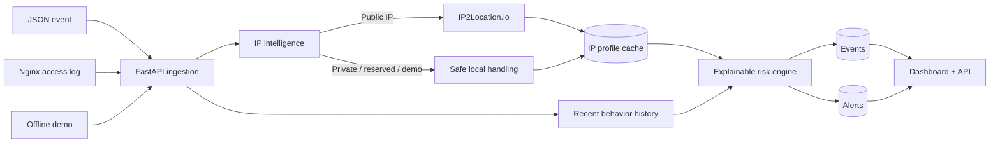

# GeoShield

**Explainable IP threat intelligence for web traffic — powered by IP2Location.io.**

GeoShield turns ordinary web access events into geographic and behavioral security signals. It ingests JSON events or Nginx logs, enriches public IP addresses with IP2Location intelligence, scores suspicious behavior with readable rules, and gives the analyst a dashboard with global activity, alerts, and incident timelines.

Built for the **IP2Location Programming Contest 2026**.


## Why GeoShield

A raw IP address rarely tells a security analyst enough by itself. GeoShield adds the missing context and answers three practical questions:

1. **Where is this traffic coming from?** — country, region, city, ASN and ISP context.
2. **Why is it suspicious?** — every risk score is decomposed into human-readable rule contributions.
3. **What happened around the alert?** — incident details include the triggering request and the recent same-IP timeline.

The goal is not to hide decisions behind a black-box score. A judge can click an alert and immediately see why it fired.

## 60-second demo

1. Start the server and open `http://127.0.0.1:8000/`.
2. Click **Run Demo**.
3. Watch the overview counters, world activity and alerts populate.
4. Click any alert to open **Incident Details** and inspect the risk contributions.
5. Click **Sample attack log**, then upload that file with **Upload Nginx log** to demonstrate real log ingestion.
6. Optionally send a public IP through `POST /api/events` in Swagger at `http://127.0.0.1:8000/docs` to exercise real IP2Location enrichment.

The built-in demo is deterministic and works offline. It uses RFC documentation-only IP ranges so synthetic profiles can never shadow real public-IP intelligence.

## What it detects

| Signal | What GeoShield looks for |
| --- | --- |
| Proxy / VPN / TOR context | Proxy-related intelligence returned by the configured IP2Location tier |
| Sensitive-path probing | Requests to paths such as admin panels, `.env`, `.git` and similar targets |
| Repeated failures | Bursts of `401`, `403` and `404` responses |
| Request bursts | High request volume from one IP in a recent time window |
| Unusual country | A country that differs from a stable recent traffic baseline |
| Impossible travel | The same optional user identifier appearing in geographically distant places too quickly |
| ASN concentration | Burst activity from several distinct IPs belonging to one ASN |

Each triggered rule contributes points to an explainable `0–100` risk score. Alerts store those contributions so the decision remains auditable.

## Architecture



More detail: [`docs/ARCHITECTURE.md`](docs/ARCHITECTURE.md)

## Tech stack

- **Python 3.12+**
- **FastAPI** for the HTTP API and dashboard server
- **SQLAlchemy 2** + **SQLite** for local persistence
- **Pydantic v2** for request/config validation
- **httpx** for IP2Location.io requests
- Zero-dependency HTML/CSS/JavaScript dashboard served by FastAPI
- **pytest** integration and unit tests

The project intentionally uses a single Python server for the contest demo: fewer moving parts, faster setup, and no Node/npm requirement for judges.

## Quick start

### Fastest path

Windows Command Prompt:

```bat
run_windows.bat
```

macOS / Linux:

```bash
./run_unix.sh
```

Both scripts create a local virtual environment when needed, install the project, copy `.env.example` to `backend/.env` if missing, and start GeoShield.

### Manual Windows Command Prompt

```bat
cd backend
python -m venv .venv
.venv\Scripts\activate.bat
python -m pip install -e ".[dev]"
copy ..\.env.example .env
python -m uvicorn app.main:app --reload
```

### Manual macOS / Linux

```bash
cd backend
python3 -m venv .venv
source .venv/bin/activate
python -m pip install -e '.[dev]'
cp ../.env.example .env
python -m uvicorn app.main:app --reload
```

Open:

- Dashboard: `http://127.0.0.1:8000/`
- Swagger API: `http://127.0.0.1:8000/docs`
- Health check: `http://127.0.0.1:8000/health`

## IP2Location configuration

Copy `.env.example` to `backend/.env` and optionally provide an API key:

```dotenv
GEOSHIELD_DATABASE_URL=sqlite:///./geoshield.db
IP2LOCATION_API_KEY=
IP2LOCATION_API_URL=https://api.ip2location.io/
```

GeoShield never sends private, loopback, link-local, reserved or documentation-only IP addresses to the external provider. Real API keys must never be committed.

## API

| Method | Endpoint | Purpose |
| --- | --- | --- |
| `POST` | `/api/events` | Ingest one normalized event |
| `POST` | `/api/logs/upload` | Parse and ingest an Nginx combined log |
| `POST` | `/api/demo/start` | Seed deterministic demo traffic |
| `GET` | `/api/demo/sample-log` | Download the sample attack log |
| `GET` | `/api/overview` | Dashboard metrics |
| `GET` | `/api/events` | Recent enriched events |
| `GET` | `/api/alerts` | Recent alerts |
| `GET` | `/api/alerts/{id}` | Incident details + same-IP timeline |
| `GET` | `/api/geo/activity` | Aggregated geographic activity |

## Example: ingest a real event

With the server running:

```bash
curl -X POST http://127.0.0.1:8000/api/events \
  -H "Content-Type: application/json" \
  -d '{"ip":"8.8.8.8","method":"GET","path":"/admin","status":403,"synthetic":false}'
```

Then refresh the dashboard and inspect the resulting event/alert.

## Nginx log demo

A repeatable fixture is included at:

```text
backend/demo/attack.nginx.log
```

You can also download it directly from the dashboard using **Sample attack log**, then feed it back into **Upload Nginx log**.


## Tests

```bash
cd backend
python -m pytest -q
```

The test suite covers startup, database behavior, IP enrichment, privacy safeguards, log parsing, risk rules, demo isolation, APIs, incident details and dashboard assets.

## Privacy and safety choices

- No credentials or request bodies are stored by V1.
- Private/reserved/local IPs are not sent to IP2Location.io.
- Enrichment failure does not block event ingestion.
- Demo traffic is explicitly marked `synthetic`.
- Demo profiles are isolated from real public-IP cache entries.
- Risk decisions remain rule-based and explainable rather than pretending to be certainty.

## Current limitations

GeoShield is a contest/demo security analysis tool, not a replacement for a production SIEM or WAF. V1 intentionally does not include packet capture, automatic blocking, authentication, a message broker, distributed storage, ML-based classification, or long-term threat-feed correlation.

## Repository guide

```text
backend/app/             FastAPI application
backend/app/api/         HTTP endpoints
backend/app/risk/        Explainable risk engine
backend/app/services/    Ingestion, IP intelligence, demo and log parsing
backend/app/web/         Dashboard HTML/CSS/JavaScript
backend/demo/            Repeatable Nginx attack fixture
backend/tests/           Automated tests
docs/ARCHITECTURE.md     Architecture and data-flow notes
docs/DEMO_SCRIPT.md      Judge-facing demo script
docs/SUBMISSION.md       Draft contest submission copy
```

## License

GeoShield is released under the [MIT License](LICENSE).

## Contest

IP2Location Programming Contest 2026 runs online from **July 1 to September 30, 2026**. The official rules state that judging considers **creativity, functionality, and GitHub stars**, so this repository is designed to be both easy to run and easy to understand.

Official contest site: https://contest.ip2location.com/

---

**GeoShield — turn IP context into an explanation, not just a dot on a map.**