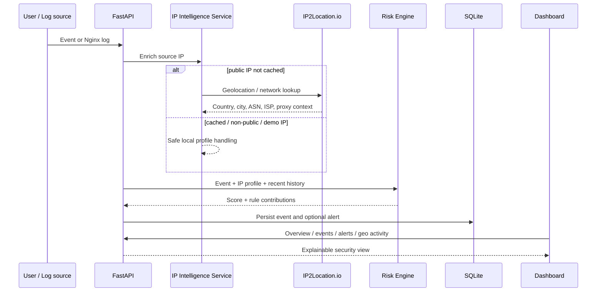

# GeoShield Architecture

## Design goal

GeoShield keeps the contest demo deliberately small and inspectable: one FastAPI process, one SQLite database, a pluggable IP intelligence boundary, and a deterministic rule engine. The same ingestion path is used by JSON events, uploaded Nginx logs, and the built-in demo.

## Data flow

## Components

### `app/services/ip_intelligence.py`

Owns public-IP classification, caching, and the provider boundary. Production uses `IP2LocationHTTPProvider`; tests can inject a deterministic fake provider. Non-public addresses are never sent to the external lookup service.

### `app/services/ingestion.py`

The orchestration layer. It enriches an event, gathers recent history, asks the risk engine for a decision, and persists the result. Keeping orchestration here prevents the API routes from containing security logic.

### `app/risk/engine.py`

A deterministic, explainable weighted rule engine. A result contains the final risk score plus individual rule contributions. This makes the UI able to answer “why was this alert raised?” without reverse-engineering the score.

### `app/services/log_parser.py`

Parses Nginx combined-log lines into normalized events. Malformed lines are skipped and counted rather than crashing a whole upload.

### `app/services/demo.py`

Creates a deterministic scenario that demonstrates normal traffic, failed authentication, proxy/network context and scanning behavior. It uses documentation-only address ranges and synthetic profiles so the demo works offline and never contaminates real-IP enrichment.

### `app/web/`

A zero-dependency dashboard served by the same FastAPI process. It visualizes overview metrics, geographic activity, recent events, alerts, and an incident-detail drawer.

## Persistence model

- **Event** — timestamp, source IP, HTTP request metadata, risk score, enrichment status, optional user/session identifiers.
- **IPProfile** — geolocation/network metadata cached per IP.
- **Alert** — event reference, severity, score, explanation and per-rule contributions.

## Why this architecture fits the contest

- **Fast to run:** one Python server and SQLite.
- **IP2Location is central:** real event analysis uses the provider boundary before risk evaluation.
- **Judge-friendly:** deterministic offline demo and a sample log avoid dependency on network/API quota for the presentation.
- **Explainable:** rules and timelines make the output inspectable.
- **Extensible:** the provider, risk engine and ingestion path are separate, so adding new feeds or scoring rules does not require rewriting the API.
